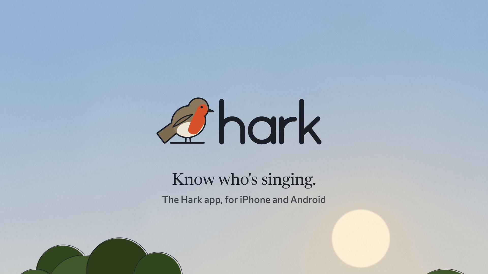

# Cinematic Film Kit

Short films, made with code. Remotion and WebGL for the picture, a synthesised score for the sound,
and a set of tools to render and check the result with your coding agent.

[Watch Hark](examples/hark/hark.mp4), a 22 second demo for a fictional birdwatching app.

The default workflow draws and synthesises everything locally. Paid generation is optional.
The kit's own code is MIT licensed; [Remotion has separate terms](https://www.remotion.dev/license).

## What you need

- A computer running Windows 10 or 11, macOS 13 or newer, or Linux, with about 5 GB free.
- **Node.js 22.18 or newer** and **ffmpeg**. Setup below.
- A coding agent that can run commands on your machine: Claude Code, Codex CLI, Cursor, Gemini
  CLI, GitHub Copilot (agent mode in VS Code), Windsurf, Cline, OpenCode or Aider. Any of them
  will do; the kit tells each one how to work. A chat model without a terminal also works if you
  run the commands yourself (see `CHAT.md`).

## Set up (about ten minutes)

1. Install Node.js and ffmpeg:
   - **Windows** (PowerShell): `winget install OpenJS.NodeJS.LTS` and `winget install Gyan.FFmpeg`,
     then open a new terminal.
   - **macOS** ([Homebrew](https://brew.sh)): `brew install node ffmpeg`.
   - **Linux** (Debian or Ubuntu): `sudo apt install ffmpeg`, and Node 22 or newer from
     [nodejs.org](https://nodejs.org) or your package manager.
   - **Or Docker**, which needs nothing else: see `docker/README.md`.
2. Clone this repository or unzip a [release](https://github.com/fergo5002/cinematic-film-kit/releases).
3. Open the folder in your agent (or open a terminal in it and start the agent there).
4. Say: **"Set this kit up and check it works."** The agent runs `npm run doctor`, installs the
   dependencies with `npm ci` and checks your graphics setup. The first render downloads a
   headless Chrome of about 110 MB.

If you would rather do it yourself: `npm run doctor`, `npm ci`, `npm run doctor` again.

## Make your first film

Tell the agent what you want, in plain words. For example:

> Make a 20 second launch film for my bakery, Crumb & Co. We bake sourdough overnight and you can
> order by 9pm for collection at 7am. Sound on. Here are our logo and colours.

> Make a 30 second product film for our scheduling app. Here are screenshots of the real screens
> it should show, and the three things it does better than a spreadsheet.

The agent will write a brief, propose concepts, show you style frames as stills, then render,
score, master and review the film, and hand you `out/<name>/<name>.mp4` with a short report. Give
it notes like you would give an editor: what feels slow, what is unclear, what you love. A
person's reaction to the moving film is the most valuable review there is.

## How each agent picks up the instructions

Everything an agent needs is in `AGENTS.md` and the skill in `.agents/skills/cinematic-film/`.
As of October 2026:

| Agent | What it reads | Anything to do |
|---|---|---|
| Claude Code | `CLAUDE.md`, which imports `AGENTS.md` | nothing |
| Codex CLI | `AGENTS.md`; skills in `.agents/skills` | nothing |
| Cursor | `AGENTS.md` | nothing |
| Gemini CLI | `GEMINI.md`, which imports `AGENTS.md` | nothing |
| GitHub Copilot (VS Code agent mode) | `AGENTS.md` and `.github/copilot-instructions.md` | nothing |
| Windsurf | `AGENTS.md` | nothing |
| Cline | `AGENTS.md` | make sure AGENTS.md support is on |
| OpenCode | `AGENTS.md` | nothing |
| Aider | `.aider.conf.yml`, which loads `AGENTS.md` and the skill | start `aider` from this folder |
| A chat model with no terminal | `CHAT.md` | upload it, then run the commands it gives you |

Agents change fast. If yours does not seem to have read the instructions, say "Read AGENTS.md and
follow it" at the start of the session.

## Free, or with connectors

**Free** is the default and needs nothing more. Everything is drawn and synthesised in code.

**Connectors** add paid generation (images, video, sound effects, music, speech) from fal,
Replicate, ElevenLabs, OpenAI and Google, behind one command with a hard spending cap and a record
of every file generated. Set it up only if you want it: `connectors/README.md`. Generated media is
held to the same checks as drawn work.

## What is in the box

| Path | What |
|---|---|
| `AGENTS.md` | the operating manual every agent follows |
| `.agents/skills/cinematic-film/` | the craft: motion, structure, sound, type, colour, the checks, and the research behind them |
| `src/films/` | one folder per film; `hark` is the example, `template` is where new films start |
| `src/engine/`, `audio/` | shared drawing, shader and sound code |
| `tools/` | doctor, rendering, stills, contact sheets, the audit, the slop lint, review packets, release |
| `reviews/prompts/` | the cold explain-back and the critic |
| `connectors/` | optional paid generation, with mocks and tests |
| `docker/` | a Linux render box |
| `examples/hark/` | the example film and its review records |
| `docs/` | longer guides: per-agent notes, troubleshooting |

## Maintaining a release

Commit source changes, then run `python tools/package-source.py` (Python 3.11 or newer).
Commit the generated `MANIFEST.json` before tagging. `python tools/package-source.py --check`
checks the committed manifest against the committed source. The packager refuses dirty source
and writes a ZIP and checksum under `dist/`. Python is only needed for this maintainer step.

## Licences

The kit's own code and writing are MIT licensed (`LICENSE`). It installs third-party software
with its own terms, listed in `THIRD_PARTY_NOTICES.md`. One matters for business use:
**Remotion**, the video engine, is free for individuals, for companies of up to three employees,
for non-profits and for evaluation; other companies need a Remotion company licence (see
remotion.dev/license). The bundled fonts
are SIL Open Font Licence, which covers video.

## What has and has not been tested

Tested before release, on a 2023 Windows 11 laptop with integrated graphics and in a clean Linux
container built from the zip: set-up, the template and the example film end to end, every tool's
own test suite, and two independent code reviews whose findings were all fixed. Not tested yet: a
fresh agent making a film from this folder alone, macOS, and agents other than the ones the
author uses (their instruction files are set up from each one's documentation). The connectors
are tested against local mocks built from each provider's documentation, with the error replies
that could only be guessed marked as guesses, because no keys were used. The details are in
`docs/testing.md`.
